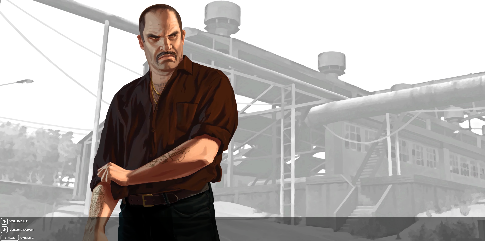

# GTA_IV_Loading_Screen_FiveM
Script made by **DodgergamingJR**.

# How to Install
- Download file and drop in your “**resources**” folder
- Add to your **server.cfg** file:  ***ensure GTA_IV_Loading_Screen_FiveM***

# Controls
- **Space** (Play/Stop music)
- **ArrowUp-Key** (Volume up)
- **ArrowDown-Key** (Volume down)

# Example Images

 

 
